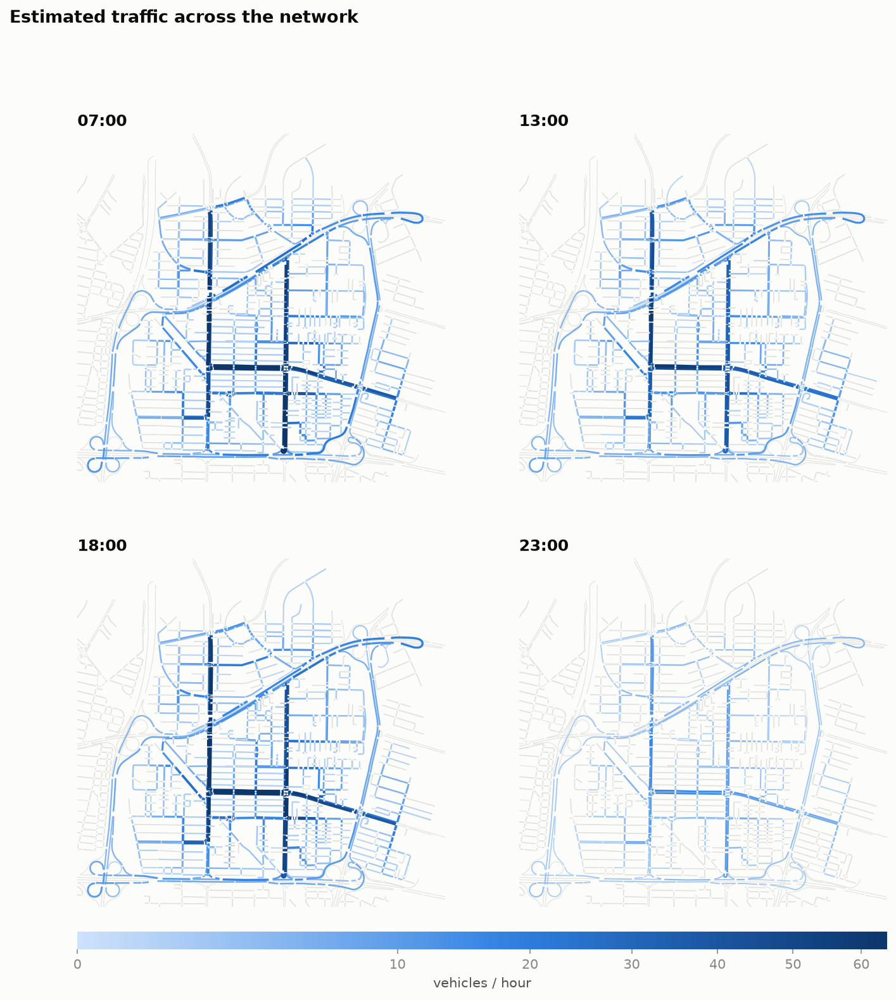
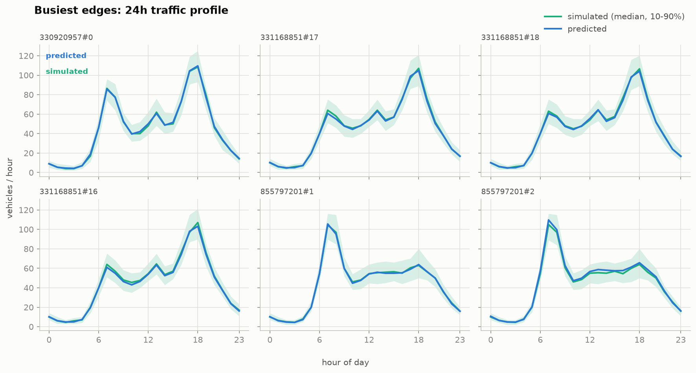
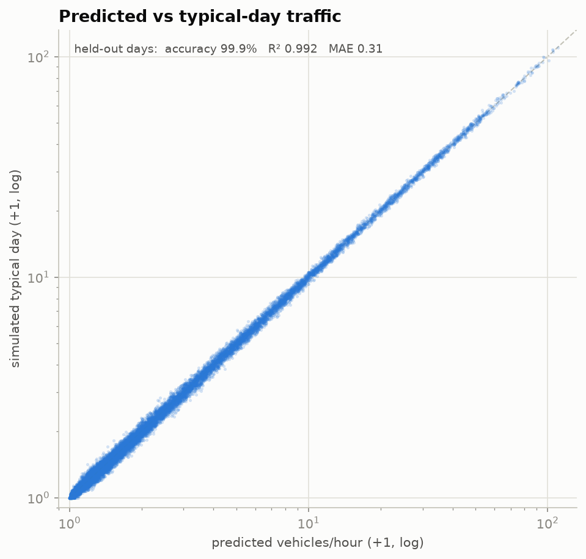
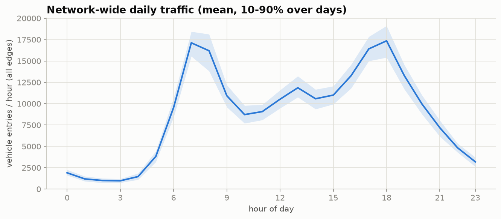

# Traffic-Estimate

Google-Maps-style hourly traffic forecasting on a SUMO network. The pipeline
generates synthetic 24-hour OD demand, simulates it with SUMO **meso**, and
trains a neural network that answers: *given an edge and an hour, how many
vehicles pass it on a typical day?*

Current experiment: `sumo/tehran_2026_area.net.xml` (3,229 car edges), but every
script takes the network as an argument, so any SUMO map works.



## Results (held-out simulated days)

| metric | per single day | typical day (avg of test days) |
|---|---|---|
| accuracy (within 20% or 3 veh) | 94.9% | **99.9%** |
| R² | 0.950 | **0.992** |
| MAE (veh/h) | 0.82 | 0.31 |

The model recovers the true hourly rate of every edge almost exactly (it matches
an oracle per-edge/hour lookup table). The ~5% residual on single days is the
irreducible day-to-day Poisson randomness of the demand itself, which is why the
typical-day score — what a Google-Maps-style forecast actually estimates — is
the headline metric.



## Setup

- SUMO ≥ 1.18 CLI tools (`sumo`, `od2trips`, `duarouter`)
- `conda activate traffic` (python, pytorch, pandas, numpy, matplotlib,
  networkx, sumolib)

## Pipeline

```bash
# 1. TAZ zones on the target net (3x3 grid, car edges of the largest
#    connected component only). Alternatively remap an existing TAZ file:
#    --taz sumo/taz_9.xml --taz-net sumo/prune_tab.net.xml
python scripts/build_taz.py --net sumo/tehran_2026_area.net.xml \
    --grid 3 --out output/taz/taz_grid9.xml

# 2. 60 synthetic days of OD demand (SUMO tazRelation XML, 24 hourly
#    intervals: 07:00 commute peak, 13:00 return bump, 17-19:00 evening peak)
python scripts/generate_od.py --taz output/taz/taz_grid9.xml \
    --out-dir output/od --num 60 --daily-trips 6000

# 3. simulate every day for 24h with SUMO meso (~3.5s per day)
python scripts/run_sim.py --net sumo/tehran_2026_area.net.xml \
    --taz output/taz/taz_grid9.xml --od-dir output/od --out-dir output/sim

# 4. hourly edgeData -> dataset (scenario, edge, hour, vehicles entered)
python scripts/build_dataset.py --net sumo/tehran_2026_area.net.xml \
    --sim-dir output/sim --out-dir output/dataset

# 5. train (models: mlp | gru | table)
python scripts/train.py --data-dir output/dataset --out-dir output/model \
    --model mlp --test-scenarios 8 --val-scenarios 3 --hidden 256 --emb-dim 64

# 6. inference: edge + time -> traffic
python scripts/predict.py --model-dir output/model --edge "330920957#0" --time 7
# edge 330920957#0 at 07:00 -> 85.8 vehicles/hour
python scripts/predict.py --model-dir output/model --edge "330920957#0" --profile

# 7. figures (network heatmap, profiles, accuracy scatter, daily curve)
python scripts/visualize.py --net sumo/tehran_2026_area.net.xml \
    --data-dir output/dataset --model-dir output/model --out-dir output/figures
```

## Model

Inference input is only `(edge, hour)` — no live sensor window — so this is
profile regression, not sequence forecasting. The default `mlp` model:

- **learned edge embedding** (64d) + hour embedding + sin/cos time encoding +
  static edge features (length, speed limit, lanes, priority),
- a **per-edge Fourier head** (6 harmonics over the day) so every edge owns a
  smooth 24h profile,
- trained with **Poisson NLL** — the correct likelihood for count data.

`--model gru` swaps in an RNN that decodes each edge's 24-step profile from its
embedding; `--model table` is the historical per-(edge,hour) average baseline.
Graph-based forecasters — [DCRNN](https://dl.acm.org/doi/10.1145/3532611),
STGCN, [Graph WaveNet](https://arxiv.org/pdf/2104.13096), or the
[LibCity](https://arxiv.org/pdf/2104.13096) library — are the open-source
references for the *history-window* variant of this problem (predicting the
next hour from the last hour of sensor readings) and would be the next step if
live measurements become available.

## Using another map

Nothing is Tehran-specific: pass your `.net.xml` to `build_taz.py` (grid mode
works on any map; remap mode converts a foreign TAZ through geo-coordinates)
and run the same pipeline. `taz_9.xml` was built for `prune_tab.net.xml`, whose
3 km grid barely intersects this smaller map — that's why the experiment uses
an equivalent 9-zone grid generated directly on the target net.



